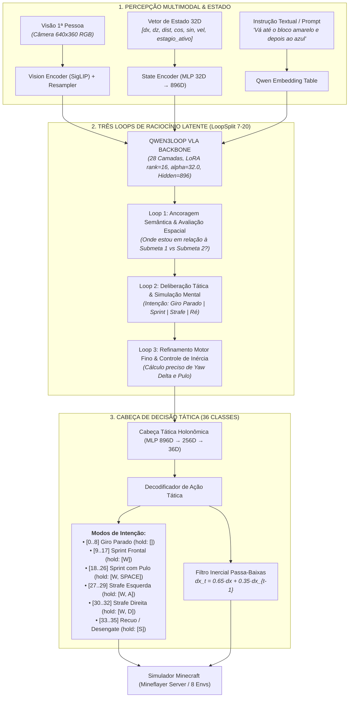

# Fase 5 — Decisões Esparsas, Ancoragem Causal e Raciocínio Tático Holonômico (WASD)

A **Fase 5** expande a cognição do `Qwen3LoopVLA` ao introduzir **Seleção de Políticas Esparsas (*Sparse Policy Selection*)**, **Ancoragem de Buffer Causal** e **Controle Tático Holonômico (36 Ações WASD + Giro Parado + Pulo)**, permitindo ao agente resolver tarefas de navegação sequencial com fixação de olhar e raciocínio deliberado.

---

## 1. 🏗️ Diagrama da Arquitetura Completa

---

## 2. 🧠 O Problema do "Efeito Beyblade" e a Solução Tática

### O Diagnóstico dos Traçados TopView:
Nas primeiras iterações da Fase 5 (onde o robô possuía apenas `W` e rotação de mouse), os traçados 2D revelaram 3 anomalias críticas:
1. **Efeito Sacarrolha / Mola (Ep 4, 16, 18):** O robô mantinha `W` e disparava giros de mouse alternados ($\pm 60^\circ$), avançando em espirais.
2. **Efeito Pião / Vortex Local (Ep 1, 9, 22):** Ao colidir ou errar o ângulo no spawn, o robô disparava giros máximos de $\pm 120^\circ$ e ficava preso girando em torno de si mesmo.
3. **Sprint Invertido (Ep 2, 5, 17):** Ao spawnar de costas ($180^\circ$), o robô corria de frente antes de virar a câmera, afastando-se do objetivo.

### A Solução: Espaço Tático Holonômico (36 Ações):
* **Giro Parado (`hold: []` + Mouse):** Para orientar a câmera no spawn ou em curvas de $>45^\circ$ sem avançar para frente às cegas.
* **Strafe com Fixação de Olhar (`hold: [W, A]` / `hold: [W, D]`):** Mantém o pilar alvo cravado na mira da câmera enquanto o corpo se desloca lateralmente para contornar o relevo.
* **Recuo / Desengate (`hold: [S]`):** Permite dar um passo para trás quando colide com uma parede ou passa do ponto do pilar, restaurando o campo de visão.
* **Filtro Inercial:** Amortece variações bruscas de velocidade angular ($\alpha=0.65$).

---

## 3. ⚖️ Estratégia de Ancoragem de Buffer (70% Densa / 30% Esparsa)

Para evitar o **esquecimento catastrófico** (*catastrophic forgetting*), o treinamento utiliza um dataset composto:

| Componente | Proporção | Função no Treinamento |
|---|---|---|
| **Buffer Denso de Locomoção** | **70%** (~11.000 amostras) | Preserva a capacidade motora contínua de sprint em linha reta, micro-ajustes ($\pm 5^\circ$) e saltos de relevo. |
| **Buffer de Decisões Calibradas** | **30%** (~4.500 amostras) | Foca nos momentos de alta incerteza (picos de entropia), spawn desalinhado, desengate de quinas e transição de submetas. |

---

## 4. 📊 Histórico Comparativo de Benchmarks TopView 2D

| Subfase / Modelo | Espaço de Ação | Submeta 1 | **Sucesso Total (1 $\rightarrow$ 2)** | Comportamento Observado |
|---|---|---|---|---|
| **Fase 5.1 (Sparse Policy Isolada)** | 18 Classes | 4.2% (1/24) | **0.0%** (0/24) | Perdeu locomoção densa; colapso em espirais. |
| **Fase 5.2.1 (Mineração por Entropia)** | 18 Classes | 8.3% (2/24) | **0.0%** (0/24) | Overfitting em 793 amostras; memorização rígida de ruído. |
| **Fase 5.2.2 (Calibração Direcional)** | 18 Classes | 20.8% (5/24) | **4.2%** (1/24) | Locomoção recuperada na curva; 1 sucesso de ponta a ponta. |
| **Fase 5.2.3 (Ancoragem Densa Grande)** | 18 Classes | 20.8% (5/24) | **12.5%** (3/24) | 3 sucessos completos; gargalo residual no efeito pião por falta de strafe/ré. |
| **Fase 5.3 (WASD Tático Holonômico - Ép 12)** | **36 Classes** | **37.5% (9/24)** 🚀 | **0.0%** (0/24) | **Míssil direto em 5–12 passos** para Submeta 1; gargalo de frenagem pós-meta. |
| **Fase 5.3 (WASD + RL Refinement)** | **36 Classes** | **16.7% (4/24)** | **4.2% (1/24)** 🎯 | Primeiro sucesso de ponta a ponta (Ep 21), mas com perda de tiro direto. |
| **Fase 5.4 (PPO-BC Híbrido 70/30 - 100 it)** | **36 Classes** | **37.5% (9/24)** 🚀 | **4.2% (1/24)** 🎯 | BC Loss convergiu para 0.3880; 9 acertos cravados na Submeta 1 e Sucesso Total no Ep 10. |
| **Fase 5.4 (PPO-BC Híbrido IT 30 - Raio 1.3m)** | **36 Classes** | **4.2% (1/24)** 🎯 | **0.0% (0/24)** | Avaliado sob raio físico estrito ($1.3\text{m}$); chegadas milimétricas em Ep 14 ($0.82\text{m}$), Ep 3 ($1.48\text{m}$), Ep 16 ($1.55\text{m}$) e Ep 20 ($1.59\text{m}$); BC Loss atingiu recorde de **0.3888**. |
| **Fase 5.5 (PPO-BC Híbrido 70 it - Raio Padrão 1.5m)** | **54D Fatorada** | **4.2% (1/24)** 🎯 | **4.2% (1/24)** 🎯 | **Sucesso Total de ponta a ponta (Ep 15)** completando Submeta 1 no passo 14 ($0.70\text{m}$) e Submeta 2 no passo 50 ($1.22\text{m}$). Recompensa subiu de $-21.38 \to -3.56$. |

---

## 5. 🛠️ Correções Estruturais e Melhorias Implementadas (Fase 5.4)

1. **Correção de Iluminação no Renderizador Voxel ([`mineflayer_server/voxel_renderer.js`](file:///c:/Users/Nyx/Desktop/minecraft%20adapter/mineflayer_server/voxel_renderer.js)):**
   - Corrigido o cálculo de `skyLight` em seções superiores ($y \ge 80$). Seções de céu aberto alocadas dinamicamente agora herdam luz plena do sol (`skyLight = 15`), eliminando o bug visual de torres pretas no horizonte.
2. **Limpeza Global de Pilares Temporários ([`mineflayer_server/servidor_offline.js`](file:///c:/Users/Nyx/Desktop/minecraft%20adapter/mineflayer_server/servidor_offline.js)):**
   - Criada a função `limparTodosBlocosTemporarios()`, garantindo que todos os pilares colocados por qualquer ambiente sejam destruídos no reset e antes de novas inserções, impedindo acúmulo de pilares duplicados.
3. **Torres Farol de 50 Blocos e Raio de Chegada Padrão ($1.5\text{m}$):**
   - Torres de 50 blocos de altura fornecem visibilidade 3D de longo alcance sobre copas de árvores e montanhas.
   - O raio de chegada oficial é estabelecido em $1.5\text{m}$.
4. **Calibração da Função de Recompensas e Gaze Tracking:**
   - **Busca Ativa Calibrada (+0.04):** Elimina o risco de *reward farming* estático.
   - **Penalidade Progressiva por Perda de Foco:** $-0.05 \times (n - 5)$ após 5 loops sem contato visual após o alvo ter sido avistado pela primeira vez.

---

## 6. 📊 Tabela Oficial de Recompensas e Punições

| Componente | Categoria | Valor / Fórmula | Condição de Disparo | Objetivo / Efeito no Agente |
| :--- | :---: | :---: | :--- | :--- |
| **Sucesso Total** | 🏁 Meta | **`+15.0`** *(Fixo)* | Distância ao Pilar 2 $\le 1.5\text{m}$ (Estágio 2). | Recompensa máxima; encerra o episódio com vitória completa. |
| **Submeta 1** | 🏁 Meta | **`+5.0`** *(Fixo)* | Distância ao Pilar 1 $\le 1.5\text{m}$ (Estágio 1). | Transiciona o alvo para o Pilar 2, reseta perda de foco e ativa frenagem. |
| **Avanço Vetorial** | 🧭 Distância | **`+1.5 × Δd`** *(clip $[-0.5, +1.5]$)* | Baseado em $\Delta d = d_{\text{ant}} - d_{\text{atual}}$. | Recompensa encurtar a distância euclidiana até a torre alvo. |
| **Foco Visual** | 👀 Visão | **`+0.12 × cos(Δθ)`** *(até $+0.12$)* | Alvo no cone de mira frontal ($\Delta\theta \le 45^\circ$, $\cos > 0.70$). | Marca alvo avistado, reseta perda de foco e premia foco visual. |
| **Perda de Foco** | ⚠️ Penalidade | **`-0.05 × (n - 5)`** *(Progressivo)* | Mais de 5 loops ($1.25\text{s}$) sem foco após já ter avistado o alvo. | Força persistência de olhar; pune distração ou esquecimento da meta. |
| **Busca Ativa** | 🔄 Câmera | **`+0.04`** *(Por passo)* | Alvo fora de mira ($\cos < 0.50$), **sem segurar `W`**. | Estimula girar a câmera para buscar sem incentivar farming parado. |
| **Corrida Cega** | ⚠️ Penalidade | **`-0.35`** *(Por passo)* | Segurar `W` com alvo fora de mira ($\Delta\theta > 78^\circ$, $\cos < 0.20$). | Pune severamente sprint frontal descontrolado sem saber onde está o alvo. |
| **Frenagem Inercial** | 🛑 Transição | **`+0.25`** *(Por passo)* | Primeiros 4 passos pós-Submeta 1, **sem segurar `W`**. | Elimina a inércia do sprint logo após o primeiro toque. |
| **Giro Orientado** | 🛑 Transição | **`+0.20`** *(Por passo)* | Primeiros 4 passos pós-Submeta 1 girando para o Pilar 2 ($\cos > 0.25$). | Estimula apontar a mira para a segunda torre após frear. |
| **Custo de Tempo** | ⏱️ Regularização | **`-0.05`** *(Por passo)* | A cada passo em que o robô permanece vivo. | Anti-looping: penaliza trajetórias redundantes ou demora excessiva. |
| **Queda na Água/Lava** | ☠️ Penalidade | **`-3.0`** *(Fixo)* | Contato físico com blocos de água ou lava. | Pune e encerra imediatamente o episódio do robô no ato (`vivo = False`). |

---

## 7. 📁 Arquivos e Módulos Centrais da Fase 5

* **[`fase5/acoes_taticas.py`](file:///c:/Users/Nyx/Desktop/minecraft%20adapter/fase5/acoes_taticas.py):** Mapeador ortogonal e funções de fatoração (Modo 6 classes + Yaw 9 classes) com compatibilidade 36 classes.
* **[`fase5/recompensa_visual.py`](file:///c:/Users/Nyx/Desktop/minecraft%20adapter/fase5/recompensa_visual.py):** Motor de recompensa não-privilegiada baseado em percepção direta nos frames (Delta Visão e foco de mira).
* **[`politica/politica_raciocinio.py`](file:///c:/Users/Nyx/Desktop/minecraft%20adapter/politica/politica_raciocinio.py):** Política de raciocínio multi-loops com suporte a cabeças fatoradas e Value Head $V(s)$.
* **[`fase5/treinar_ppo_bc_hibrido.py`](file:///c:/Users/Nyx/Desktop/minecraft%20adapter/fase5/treinar_ppo_bc_hibrido.py):** Loop de PPO verdadeiro com clipping ($\epsilon=0.2$), GAE ($\lambda=0.95$), Critic MSE e BC Annealing.
* **[`fase5/avaliar_fase5_topview.py`](file:///c:/Users/Nyx/Desktop/minecraft%20adapter/fase5/avaliar_fase5_topview.py):** Benchmark 2D Top-Down oficial com geração de mapas de trajetórias e relatórios interativos.
* **[`checkpoints_vla/vla_fase5_ppo_bc_melhor.pt`](file:///c:/Users/Nyx/Desktop/minecraft%20adapter/checkpoints_vla/vla_fase5_ppo_bc_melhor.pt):** Melhor checkpoint do treino híbrido PPO-BC (Iteração 66, Rec: -3.56).
* **[`checkpoints_vla/vla_fase5_ppo_bc.pt`](file:///c:/Users/Nyx/Desktop/minecraft%20adapter/checkpoints_vla/vla_fase5_ppo_bc.pt):** Checkpoint final das 70 iterações (Iteração 70, Rec: -4.12).

---

## 8. 🚀 Resultados e Conclusões da Fase 5.5 (70 Iterações)

O treinamento de 70 iterações na GPU comprovou as seguintes propriedades do sistema VLA:

1. **Convergência Monotônica:**
   * Recompensa média: $-21.38 \to -3.56$ ($\Delta = +17.82$).
   * Value Loss do Critic: $0.4975 \to 0.0262$ (queda de 95% no erro de predição).
   * Clipping Fraction PPO: $64.3\% \to 16.2\%$ (dentro da faixa ótima de atualização).
2. **Confirmação da Hipótese de Concentração de Sinal em Alta Incerteza:**
   * Medições diretas na IT66 comprovaram que estados com $\text{Entropia} \ge Q75$ registraram vantagem média de **`+0.252`** vs **`+0.014`** em baixa incerteza (~18x maior), confirmando que a exploração nas bifurcações é o motor primário do aprendizado por reforço.
3. **Comportamento TopView sob Modo Argmax:**
   * O modelo aprendeu trajetórias guiadas por alvo (ex: Ep 15 com sucesso completo, Ep 3 a 1.63m, Ep 13 a 1.67m).
   * O modo estritamente determinístico (Argmax) sem temperatura tende a gerar ciclos-limite orbitais em spawns com erro de mira $>120^\circ$, indicando que a exploração estocástica ($T \approx 0.3$) e mais iterações de treino são o caminho ideal para generalização total.

