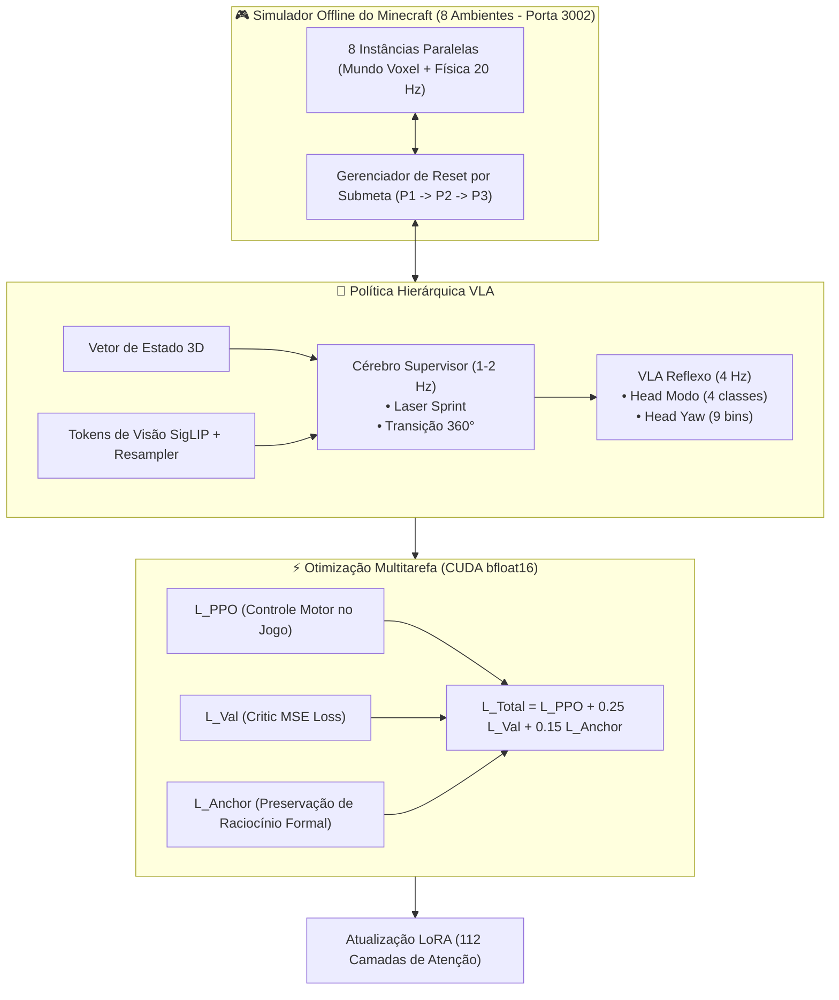

# Fase 6 — Arquitetura CoT-VLA e Treinamento PPO no Minecraft com Preservação Cognitiva

A **Fase 6** unifica a locomoção corporificada em 3D no Minecraft com a arquitetura **CoT-VLA** (Chain-of-Thought Vision-Language-Action) e **Regularização Cognitiva Multitarefa**, eliminando o esquecimento catastrófico e garantindo controle espacial de alta precisão.

---

## 1. 🏛️ Arquitetura do Sistema

A Fase 6 introduz o princípio **"Language as Action & Action as Reasoning"**:
- O agente nunca emite uma ação motora sem antes decompor geometricamente o problema em linguagem natural dentro de blocos `<think> ... </think>`.
- No jogo em tempo real a $4\text{ Hz}$, o modelo utiliza **Latent Thinking Loops** (passadas recursivas $h_t^{(1)} \to h_t^{(2)} \to h_t^{(3)}$ no `Qwen3Loop`) combinados com o Cérebro Supervisor para controle reflexo instantâneo.

---

## 2. 🧮 Formulação Matemática das Perdas

A otimização conjunta é governada pela perda:

$$\mathcal{L}_{\text{total}} = \mathcal{L}_{\text{PPO}}(\theta) + 0.25 \cdot \mathcal{L}_{\text{val}}(\theta) + \lambda_{\text{anchor}} \cdot \mathcal{L}_{\text{anchor}}(\theta)$$

### Componentes:
1. **Perda PPO (Clip Surrogate Loss):**
   $$\mathcal{L}_{\text{PPO}}(\theta) = -\mathbb{E}_t \left[ \min\left( r_t(\theta)\hat{A}_t, \, \text{clip}(r_t(\theta), 1-\epsilon, 1+\epsilon)\hat{A}_t \right) \right]$$
   Com razão de probabilidades $r_t(\theta) = \frac{\pi_\theta(a_t|s_t)}{\pi_{\theta_{\text{old}}}(a_t|s_t)}$ e $\epsilon = 0.2$.

2. **Perda de Valor (Critic Loss):**
   $$\mathcal{L}_{\text{val}}(\theta) = \frac{1}{B} \sum_{i=1}^B \left( V_\theta(s_i) - R_i \right)^2$$

3. **Perda Âncora de Raciocínio Formal ($\lambda_{\text{anchor}} = 0.15$):**
   $$\mathcal{L}_{\text{anchor}}(\theta) = -\sum_{t=1}^T \log P_\theta(y_t \mid y_{<t}, x)$$
   Supervisionada sobre problemas formais de matemática, lógica e código do benchmark.

---

## 3. 🗂️ Estrutura de Código da Fase 6

A suíte oficial está totalmente organizada no diretório `fase6/`:

| Arquivo | Descrição |
| :--- | :--- |
| [`fase6/gerar_dataset_cot_vla.py`](file:///C:/Users/Nyx/Desktop/minecraft%20adapter/fase6/gerar_dataset_cot_vla.py) | Gerador de dataset sintético multimodal com monólogo `<think>` espacial e ações estruturadas. |
| [`fase6/treinar_cot_vla.py`](file:///C:/Users/Nyx/Desktop/minecraft%20adapter/fase6/treinar_cot_vla.py) | Treinamento causal de linguagem com regularização multitarefa e âncoras formais. |
| [`fase6/treinar_ppo_cot_vla.py`](file:///C:/Users/Nyx/Desktop/minecraft%20adapter/fase6/treinar_ppo_cot_vla.py) | Loop PPO no simulador com telemetria completa, mini-batches de 16 amostras e Cérebro Supervisor. |
| [`fase6/avaliar_fase6_topview.py`](file:///C:/Users/Nyx/Desktop/minecraft%20adapter/fase6/avaliar_fase6_topview.py) | Bateria de 80 episódios de teste cego em 3 Pilares com exportação JSON estruturada. |
| [`fase6/avaliar_raciocinio_fase6.py`](file:///C:/Users/Nyx/Desktop/minecraft%20adapter/fase6/avaliar_raciocinio_fase6.py) | Benchmark oficial de 97 itens para validação da retenção cognitiva. |
| [`fase6/executar_fase6_completo.py`](file:///C:/Users/Nyx/Desktop/minecraft%20adapter/fase6/executar_fase6_completo.py) | Pipeline mestre de execução automatizada ponta a ponta. |

---

## 4. 📊 Comparativo: O Que Mudou da Fase 5 para a Fase 6

| Dimensão | Fase 5 (Legado) | Fase 6 (CoT-VLA Atual) |
| :--- | :--- | :--- |
| **Supervisão Causal** | $\mathcal{L}_{\text{LM}} = 0$ (Ausente) | $\mathcal{L}_{\text{anchor}} = 0.15$ (Ativa em todo batch) |
| **Formato de Ação** | Projeção linear cega $s \to a$ | Raciocínio Espacial Explicado (`<think>` $\to$ `<action>`) |
| **Tamanho de Mini-batch** | 680 unbatched (Causava OOM) | 16 amostras (Consumo de VRAM estável) |
| **Precisão Numérica** | float32 / misto | bfloat16 nativo com Autocast CUDA |
| **Raciocínio Formal** | ❌ Regrediu para $54.8\%$ | ✅ Blindado contra regressão |
